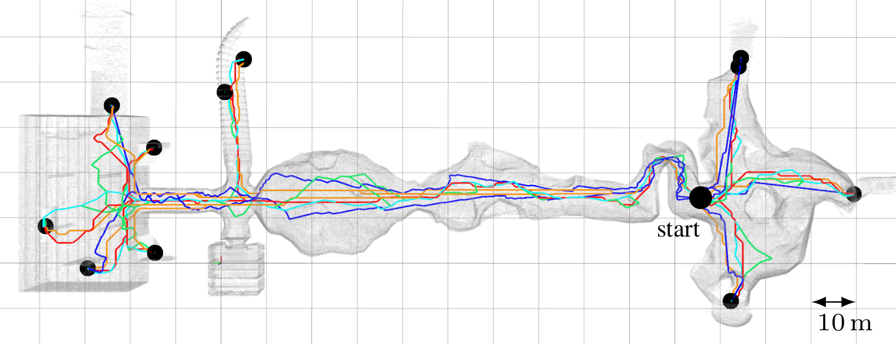
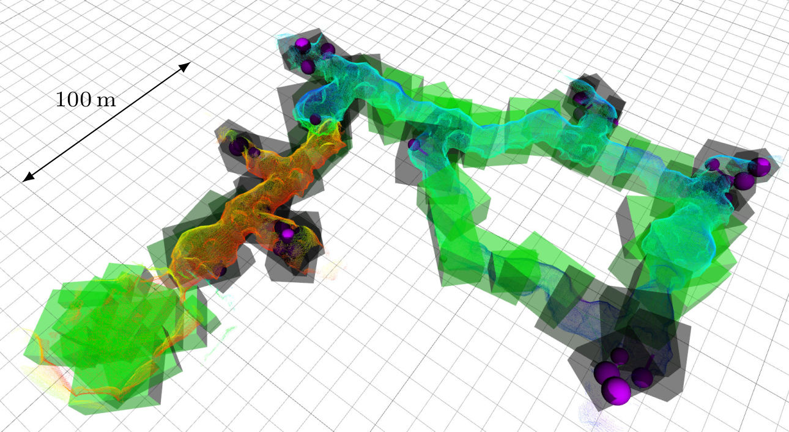

# SphereMap


## SphereMap overview

SphereMap is a multi-layer dynamic map built online on-board a UAV. 
It allows weighing path length and distance from obstacles along the path for safety-aware planning, while also finding paths faster than a conventional occupancy grid (~1 order of magnitude or ~3 orders if precomputed paths are used).
The working principle is that at `~2Hz`, the server server updates the map near the UAV's current position — filling free space with spheres, connecting them into a graph of intersecting spheres, and then segmenting this graph into approx. convex regions and computing and storing paths inside these regions for quick long-distance planning.

This package is the implementation of the article **SphereMap: Dynamic Multi-Layer Graph Structure for Rapid Safety-Aware UAV Planning**. [pdf](https://arxiv.org/pdf/2302.01833.pdf), [doi](http://dx.doi.org/10.1109/LRA.2022.3195194).

If you use the code in your research, please cite our work as:

```
Musil, T., Petrlik, M., and Saska, M. "SphereMap: Dynamic Multi-Layer Graph Structure for 
Rapid Safety-Aware UAV Planning". IEEE Robotics and Automation Letters 7(4):11007-11014, 2022. 
```

## Dependencies

Tested with ROS Noetic running on Ubuntu 20.04.


* [octomap](https://octomap.github.io/)
* [pcl_ros](http://wiki.ros.org/pcl_ros)

## Usage guide

### Running the server

The SphereMap server node requires two inputs (specified in the launch file): 

* A binary octomap as a `octomap_msgs::Octomap` message based on the [OctoMap](https://octomap.github.io/) library.
* The current UAV odometry as a `nav_msgs::Odometry` message.
 
If you connect these inputs in the launch file, the SphereMap server node will initialize and start updating the SphereMap. 
There are various configuration params with which you can play with, described in the config file, and also multiple visualization topics for Rviz.

### Safety-aware planning



Call the service `get_spheremap_path` for pathfinding in the SphereMap. 
It will transform the given start and goal points from the given frame to the SphereMap frame, try to find a path, and return it as an array of `geometry_msgs::Point` if successful.
If you set the flag `ignore_precomputed_paths` to `true` in the config file, the planning will run A* over the entire SphereMap graph, which can give a better path than using the precomputed paths, but will be slower.
If a start/goal point is not covered by the SphereMap, the planning will take the nearest sphere up to a distance specified in the config file, as the start node, so be aware of that.

The path cost is computed as in the [paper](https://arxiv.org/pdf/2302.01833.pdf), and you can set the riskiness weight (`xi` in the publication, `spheremap_planning_safety_weight` in the config file) as required. 
There is also a service for changing the weight mid-flight `set_safety_planning_params`.

### Using the LTV-Map lightweight topological-volumetric map



Currently, the LTV-Map described in the publication is built along with the SphereMap and is published as a `visualization_msgs/MarkerArray` purely for visualization. Using the LTV-Maps for cooperative exploration planning was implemented in the DARPA SubT Challenge and is described in [our other paper](https://arxiv.org/abs/2206.08185), but it was not implemented in the SphereMap server.

### Examples

An example of how to use the SphereMap can be found in the [`examples/`](https://github.com/ctu-mrs/spheremap/tree/master/examples) directory.
To run the example, first download the dataset by running the [`examples/download_dataset.sh`](https://github.com/ctu-mrs/spheremap/tree/master/examples/download_dataset.sh) script.
Then the example can be run using the [`examples/example.launch`](https://github.com/ctu-mrs/spheremap/tree/master/examples/example.launch) launchfile.
After running the launchfile, the SphereMap server is initialized, the rosbag file with the dataset is played and an RViz window shows the process of building the SphereMap.
The paths can be queried by calling the `get_spheremap_path` service.


## Possible improvements

* Adding service for planning to multiple goals at one service call (for deciding between many goals).
* Implementing LTV-Map sharing between UAVs and using them for cooperative navigation/exploration.

## Related work

The approach deployed in DARPA SubT Challenge, where SphereMap was used for planning. [pdf](https://fieldrobotics.net/Field_Robotics/Volume_3_files/Vol3_01.pdf), [doi](https://doi.org/10.55417/fr.2023001).
```
Petrlik, M., Petracek, P., Kratky, V., Musil, T., Stasinchuk, Y., Vrba, M., Baca, T., Hert, D.,
Pecka M., Svoboda, T., and Saska M., "UAVs Beneath the Surface: Cooperative Autonomy
for Subterranean Search and Rescue in DARPA SubT", Field Robotics 3:1–68, (2023).
```


The [MRS UAV system](https://github.com/ctu-mrs/mrs_uav_system) for enabling autonomous flight of UAVs. [pdf](https://link.springer.com/content/pdf/10.1007/s10846-021-01383-5.pdf), [doi](https://doi.org/10.1007/s10846-021-01383-5).
```
Baca, T., Petrlik, M., Vrba, M., Spurny, V., Penicka, R., Hert, D., and Saska, M.,
"The MRS UAV System: Pushing the Frontiers of Reproducible Research, Real-world Deployment, and
Education with Autonomous Unmanned Aerial Vehicles", J Intell Robot Syst 102, 26 (2021).
```

